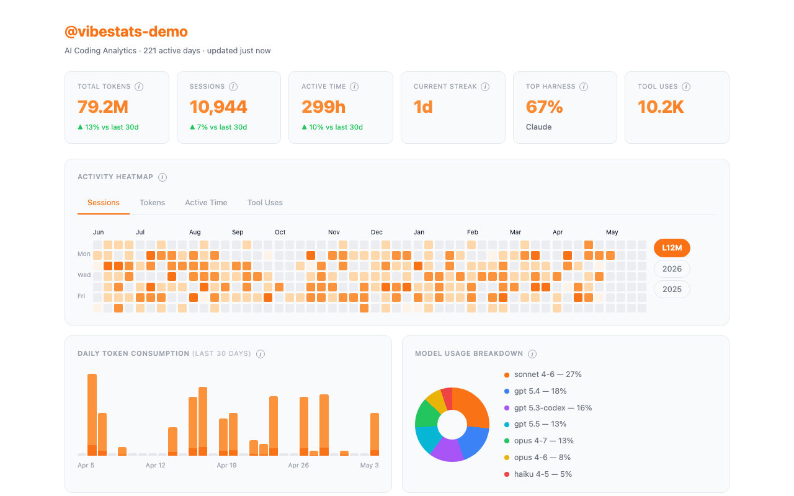
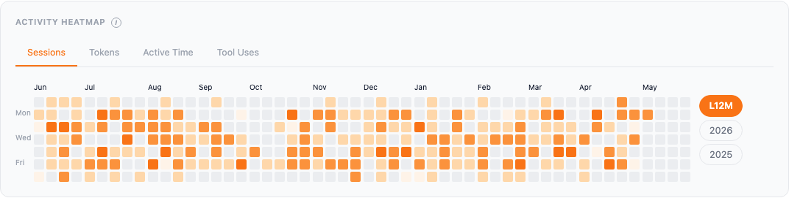
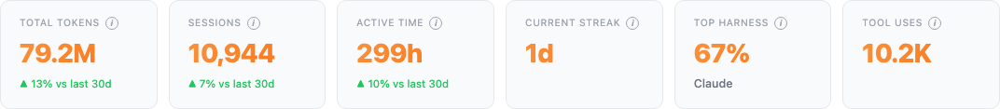
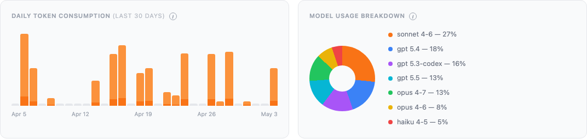

<h1 align="center">⚡ VibeStats</h1>

<p align="center">
  <a href="https://github.com/stephenleo/vibestats/actions/workflows/ci.yml"></a>
  <a href="https://crates.io/crates/vibestats"></a>
  <a href="https://crates.io/crates/vibestats"></a>
  <a href="https://github.com/stephenleo/vibestats/releases/latest"></a>
  <a href="https://github.com/stephenleo/vibestats/releases"></a>
  <a href="https://github.com/stephenleo/vibestats/blob/main/LICENSE"></a>
</p>

<p align="center">
  Track your Claude Code and Codex sessions. Get a GitHub-style heatmap on your profile and a full analytics dashboard at <strong>vibestats.dev/&lt;username&gt;</strong>.
</p>

<picture>
  <source media="(prefers-color-scheme: dark)" srcset="docs/images/dashboard-hero-dark.png">
  
</picture>

<!-- vibestats-start -->
<!-- vibestats-end -->

## Why VibeStats?

Claude Code [clears local session transcripts after 30 days by default](https://code.claude.com/docs/en/data-usage) (configurable via `cleanupPeriodDays` in `~/.claude/settings.json`). Tools that read those JSONL files can only show what's still on disk — your stats silently shrink as old sessions age out.

VibeStats syncs aggregated daily stats — tokens, sessions, minutes, model breakdown, harness mix — to your private `vibestats-data` GitHub repo on every session, *before* that cleanup fires. The sync is non-destructive by design: once a day's stats are uploaded, they stay there indefinitely.

What that gets you:

- **History past 30 days** — months and years of usage stats, without changing Claude Code's defaults.
- **Privacy by default** — Claude Code's transcript cleanup keeps doing its thing; only small JSON aggregates ever leave your machine. No prompt or response content is stored or synced.
- **Survives machine wipes and reinstalls** — your archive lives in your private GitHub repo, not on your laptop.
- **Per-machine breakdown** — every machine writes its own slice; the aggregation step combines them into one heatmap.

## What you get

A live heatmap on your GitHub profile (the embed above), and a full analytics dashboard at `vibestats.dev/<your-username>`:

<table>
  <tr>
    <td>
      <picture>
        <source media="(prefers-color-scheme: dark)" srcset="docs/images/dashboard-heatmap-dark.png">
        
      </picture>
    </td>
    <td>
      <picture>
        <source media="(prefers-color-scheme: dark)" srcset="docs/images/dashboard-kpis-dark.png">
        
      </picture>
    </td>
  </tr>
  <tr>
    <td colspan="2">
      <picture>
        <source media="(prefers-color-scheme: dark)" srcset="docs/images/dashboard-charts-dark.png">
        
      </picture>
    </td>
  </tr>
</table>

## Quickstart

### Method 1: curl installer (recommended)

```bash
curl -fsSL https://vibestats.dev/install.sh | bash
```

The installer handles everything in one step:

- Creates a private `vibestats-data` repo in your GitHub account
- Installs the daily aggregation workflow
- Configures Claude Code and Codex hooks to sync after each session when those tools are installed
- Adds the heatmap to your profile `README.md`
- Runs an initial backfill of existing session data

### Method 2: cargo install

If you already have a Rust toolchain set up and prefer crates.io:

```bash
# 1. Install the binary from crates.io
cargo install vibestats

# 2. Run the installer with --skip-binary to do the rest of the setup
#    (creates the vibestats-data repo, wires hooks, registers this machine)
curl -fsSL https://vibestats.dev/install.sh | bash -s -- --skip-binary
```

`cargo install` only ships the binary — the per-account setup (private data repo, daily workflow, hook wiring, profile-README markers) still has to run. The `--skip-binary` flag tells the installer to use the `vibestats` already on your `PATH` instead of downloading a release tarball.

### Adding a second machine

On any additional machine, re-run the same install command. The installer detects the existing `vibestats-data` repo and registers the new machine without overwriting anything.

## How it works

VibeStats has three components that work together:

1. **CLI** — installed locally, hooks into Claude Code and Codex to record session activity into a private `vibestats-data` GitHub repo after each session.
2. **GitHub Action** (`stephenleo/vibestats@v2`) — runs daily in your `vibestats-data` repo, aggregates the recorded sessions, and pushes an SVG heatmap to your GitHub profile repo.
3. **Profile heatmap** — the SVG is embedded in your profile `README.md` between marker comments, updated automatically.

## CLI reference

```
vibestats <COMMAND>

Commands:
  auth           Authenticate with GitHub
  sync           Sync all supported session data to vibestats-data
  status         Show current sync status and last sync time
  machines       Manage registered machines
  uninstall      Uninstall vibestats
```

## GitHub Action inputs

| Input | Required | Description |
|---|---|---|
| `token` | Yes | Fine-grained PAT with Contents write access to `profile-repo` |
| `profile-repo` | Yes | Your GitHub profile repo in `username/username` format |

## Contributing

See [CONTRIBUTING.md](CONTRIBUTING.md) for development setup, code conventions, and the release process (including how floating major tags work).

## License

[MIT](LICENSE)
